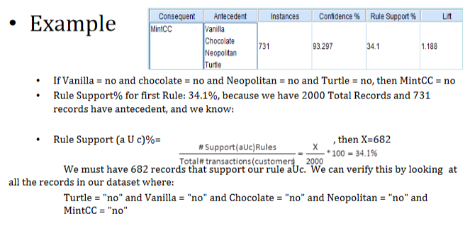
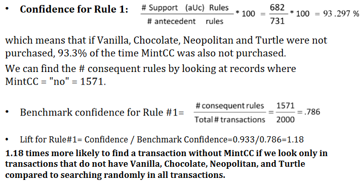

# What are Association Rules?

Association rules are used to discover interesting interactions of the variables. In other words, they show what variables go with what other variables.

The output can be thought of as 'if-then' rules. For example, if a customer purchases a TV, then they purchase a speaker set.

It's important to understand that this technique is not used for associations betweens units of analysis (e.g., customers), for that you should use clustering.

## Table of Contents

- [What are Association Rules?](#what-are-association-rules)
  - [Table of Contents](#table-of-contents)
  - [Key Terms](#key-terms)
  - [Types of Business Questions answered](#types-of-business-questions-answered)
  - [Types of Data Input](#types-of-data-input)
  - [Useful visuals and metrics](#useful-visuals-and-metrics)
    - [Useful metrics](#useful-metrics)
  - [Small Example](#small-example)
    - [Python](#python)
    - [Metrics](#metrics)

## Key Terms

1. Antecedent: The 'if' part of the rule.
2. Consequent: The 'then' part of the rule.

## Types of Business Questions answered

1. Market Basket analysis - what do customer frequently purchase together?
2. Recommendation algorithms - used by Netflix to recommend your next TV Show or movie based on what you've watched.

## Types of Data Input

Variables must be categorical or binned continuous variables.

## Useful visuals and metrics

### Useful metrics

1. Rule Support - # of transactions that include both antecedent and consequent item sets divided by the number of transactions in the data.
2. Confidence - # of transactions that include both antecedent and consequent item sets divided by the # of transactions with the antecedent.
3. Benchmark Confidence - # of times the consequent rule divided by the total number of transactions.
4. Lift - the confidence divided by the benchmark confidence
   1. If the Lift is greater than 1, there is some usefulness to the rule.

## Small Example

### Python

Modules

```python
from mlxtend.frequent_patterns import association_rules
from mlxtend.preprocessing import TransactionEncoder
from mlxtend.frequent_patterns import apriori
```

Run Model

```python
ar_df = association_rules(frequent_itemsets_book, metric= 'confidence', min_threshold=0.1)
ar_df.head()
```

<div>
<style scoped>
</style>
Outputs Table like the below
<table border="1" class="dataframe">
  <thead>
    <tr style="text-align: right;">
      <th>antecedents</th>
      <th>consequents</th>
      <th>antecedent support</th>
      <th>consequent support</th>
      <th>support</th>
      <th>confidence</th>
      <th>lift</th>
      <th>leverage</th>
      <th>conviction</th>
      <th>zhangs_metric</th>
    </tr>
  </thead>
  <tbody>
    <tr>
      <td>(Intro)</td>
      <td>(DataMining)</td>
      <td>0.605479</td>
      <td>0.821918</td>
      <td>0.482192</td>
      <td>0.796380</td>
      <td>0.968929</td>
      <td>-0.015463</td>
      <td>0.874581</td>
      <td>-0.075172</td>
    </tr>
    <tr>
      <td>(DataMining)</td>
      <td>(Intro)</td>
      <td>0.821918</td>
      <td>0.605479</td>
      <td>0.482192</td>
      <td>0.586667</td>
      <td>0.968929</td>
      <td>-0.015463</td>
      <td>0.954485</td>
      <td>-0.152593</td>
    </tr>
    <tr>
      <td>(Survey)</td>
      <td>(Intro)</td>
      <td>0.813699</td>
      <td>0.605479</td>
      <td>0.479452</td>
      <td>0.589226</td>
      <td>0.973155</td>
      <td>-0.013226</td>
      <td>0.960431</td>
      <td>-0.128971</td>
    </tr>
    <tr>
      <td>(Intro)</td>
      <td>(Survey)</td>
      <td>0.605479</td>
      <td>0.813699</td>
      <td>0.479452</td>
      <td>0.791855</td>
      <td>0.973155</td>
      <td>-0.013226</td>
      <td>0.895057</td>
      <td>-0.065351</td>
    </tr>
    <tr>
      <td>(Cat Data)</td>
      <td>(Intro)</td>
      <td>0.791781</td>
      <td>0.605479</td>
      <td>0.468493</td>
      <td>0.591696</td>
      <td>0.977235</td>
      <td>-0.010914</td>
      <td>0.966241</td>
      <td>-0.100623</td>
    </tr>
  </tbody>
</table>
</div>

### Metrics




